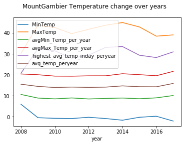

# WeatherAnalysis
* [General info](#general-info)
* [Technologies](#technologies)
* [Dataset Description](#dataset-description)
* [Data Dictionary](#data-dictionary)
* [Longest period solution](#longest-period-solution)
* [SQl Queries](#sql-queries)
* [Data Visualization](#data-visualization)
* [Setup](#setup)

## General info
This project aim is to get your hands dirty using sparksql on some dataset fo your own choice and to visualize your results. Both imperative and declerative query styles were used.
	
## Technologies
Project is created with:
* IDE IntelliJ
* JVM: 8.0
* Scala version: 2.12.12
* Spark version: 3.0.0
* Jupyter notebook
* Python 3.0
* Pandas

## [Dataset Description](https://www.kaggle.com/jsphyg/weather-dataset-rattle-package)
The dataset is called Rain in Australia Dataset. This dataset contains about 10 years of daily weather observations from many locations across Australia. The original purpose of this dataset was to predict the rainTomrrow.The dataset was used for trying to find patterns in how pressure,Temperature and wind speed changed over the years. It is also to see if these changes are shared by different locations in Australian or not.

The main Answers I was looking for were:
1. Find the Max,Min,avgMax, avgMin temperature and highest average temperature per year given location then compare it with other cities.This will show how Temperature over cities changed over years and could give a hint about a trend.
2. Find the Max,Min and avgPressure per year given location and then compare it with other cities.The same as the first answer but deals with pressure.
3. Find the Max,Min,avgWindSpeed per year given location and city then compare it with other cities.The same with the first answer but deals with wind speed.
4. What's the longest period of no rain for each city?

## Data Dictionary
The following table shows the fields that were used from the csv file for quering and analysis, and their descriptions.
|Field name | Datatype |Description
| --- | --- | --- |
|Location | String | Shows location where data was captured |
| MinTemp | float |Minimum temperature / day |
|MaxTemp | float | Maximum Temperature of/ day |
|Wind gust speed | float | Avg Wind speed/ day |
|Rain Today | String | If rain occurred today or not |
|Date column | Date | Date of data capture |
|year | Integer |Shows the year in which this data was captured |
|month |Integer | Shows the month in which this data was captured |
|Pressure | float | Average pressure captured this day |

## Longest period solution
We started by identifying the dates that Rain today value is  ‘yes’, we named it as Raindate. The second step was finding the range of days without rain.This was done by using the datediff function which finds the difference between current date and first date which is not null from a set of rows(window) that is partition by Location and grouped by date column and this date is selected from the current till the last row of the partition.Basically it will select the first non Null row from Raindate and subtract it from the currentDate to get the difference.


## SQl Queries
#### Imperative
1. Find the longest period of no rain for each city
```
    val win = Window.partitionBy($"Location").orderBy($"Datecolumn").
        rowsBetween(0, Window.unboundedFollowing)
    
    val df_answer = df_final.
        withColumn("RainDate", when($"RainToday".equalTo("Yes"),$"Datecolumn"))
          .withColumn("interval",
            datediff(first($"RainDate", ignoreNulls=true)
            .over(win), $"Datecolumn"))
            
    df_answer.select($"Location", $"Datecolumn".as("start_date"),
        max($"interval").over(Window.partitionBy($"Location")).as("max_interval")
        ).where($"interval" === $"max_interval")
```
2. Find the Max,Min,avgMax, avgMin temperature and highest average temperature per year given location.
```
df_final.select("year","Location","MinTemp","MaxTemp")
      .groupBy("Location","year").agg(min("MinTemp")
      .as("MinTemp"),max("MaxTemp")
      .as("MaxTemp"),round(avg("MinTemp"),2)
      .as("avgMin_Temp_per_year"),round(avg("MaxTemp"),2)
      .as("avgMax_Temp_per_year"),max(round(($"MaxTemp" + $"MinTemp")/2,2))
      .as("highest_avg_temp_inday_peryear"),avg(($"MaxTemp" + $"MinTemp")/2).as("avg_temp_peryear"))
      .sort("year")
```
3. Find the Max,Min and avgPressure per year given location.
```
df_final.select("year","Location","Pressure")
      .groupBy("Location","year").agg(min("Pressure")
      .as("MinPressure"),max("Pressure")
      .as("MaxPressure"),round(avg("Pressure"),2)
      .as("avg_Pressure_per_year"))
      .sort("year")
```
4. Find the Max,Min,avgWindSpeed per year given location.
```
df_final.select("year","Location","WindGustSpeed")
      .groupBy("Location","year").agg(min("WindGustSpeed")
      .as("MinWindSpeed"),max("WindGustSpeed")
      .as("MaxWindSpeed"),round(avg("WindGustSpeed"),2)
      .as("avgWindSpeed")).sort("year")
```

#### Declerative
1. Find the longest period of no rain for each city
```
val df_answer = df_final.
      withColumn("RainDate", when($"RainToday".equalTo("Yes"), $"Datecolumn"))
    df_answer.createOrReplaceTempView("data")
    
spark.sql("Select Location,Datecolumn,RainDate,
Datediff(First(RainDate,true) Over(Partition By Location Order By Datecolumn 
ROWS BETWEEN CURRENT ROW AND UNBOUNDED FOLLOWING) ,Datecolumn) As i From data")
```
2. Find the Max,Min,avgMax, avgMin temperature and highest average temperature per year given location.
```
spark.sql("Select data.Location,data.year,Min(data.MinTemp) As MinTemp,Max(data.MaxTemp) As MaxTemp ,Round(avg(data.MinTemp),2) As avgMin_Temp_per_year,Round(avg(data.MaxTemp),2) As avgMax_Temp_per_year
,max(Round((data.MaxTemp + data.MinTemp)/2,2)) 
As highest_avg_temp_inday_peryear
,avg((data.MaxTemp+data.MinTemp)/2)
As avg_temp_peryear From data Group By Location,year Order By year")
```
3. Find the Max,Min and avgPressure per year given location.
```
spark.sql("Select data.Location,data.year,
Min(data.Pressure) As MinPressure,Max(data.Pressure) As MaxPressure 
,Round(avg(data.Pressure),2) As avg_Pressure_per_year From data
Group By Location,year Order By year")
```
4. Find the Max,Min,avgWindSpeed per year given location.
```
spark.sql("Select data.Location,data.year,Min(data.WindGustSpeed)
As MinWindSpeed,Max(data.WindGustSpeed) As MaxWindSpeed 
,Round(avg(data.WindGustSpeed),2) As avg_WindSpeed_per_year From data Group By Location,year Order By year")
```
## Data Visualization
#### Data Loading
```
df1 = pd.read_csv("C:/Users/hp/Desktop/task2_2/Pressure/Pressure.csv")
df2 = pd.read_csv("C:/Users/hp/Desktop/task2_2/Temperature/Temperature.csv")
df3 = pd.read_csv("C:/Users/hp/Desktop/task2_2/Wind/Wind.csv")
df4 = pd.read_csv("C:/Users/hp/Desktop/task2_2/NoRainInterval/noRainInterval.csv")
df1.head()
```
**make sure to change file path.**

#### Data Plotting
1. plotting temperature
```
def plotTemperature(dataframe , location):
df = dataframe.loc[dataframe['Location'] == location,
["year","MinTemp","MaxTemp","avgMin_Temp_per_year","avgMax_Temp_per_year"
,"highest_avg_temp_inday_peryear","avg_temp_peryear"]]

df.plot(x="year",y=["MinTemp","MaxTemp","avgMin_Temp_per_year","avgMax_Temp_per_year","highest_avg_temp_inday_peryear","avg_temp_peryear"])

pl.suptitle(location + " Temperature change over years")
return
```


2. plotting pressure
```
def plotPressure(dataframe , location):
df = dataframe.loc[dataframe['Location'] == location,["year","MinPressure","MaxPressure","avg_Pressure_per_year"]]
df.plot(x="year",y=["MinPressure","MaxPressure","avg_Pressure_per_year"])
pl.suptitle(location + " pressure change over years")
return
```


3. plotting wind
```
def plotWind(dataframe , location):
df = dataframe.loc[dataframe['Location'] == location
,["year","MinWindSpeed","MaxWindSpeed","avgWindSpeed"]]

df.plot(x="year",y=["MinWindSpeed","MaxWindSpeed","avgWindSpeed"])
pl.suptitle(location + " Wind change over years")
return
```


4. plotting days without rain
```
def plotRanges(dataframe,locNumber):
df = dataframe.sort_values('max_interval',ascending = False).head(locNumber)
df.plot(kind='bar',x='Location',y='max_interval')
return
```


## Setup
To run this project, just run the jar file and make sure weather.csv is present in your same directry.
